# Real-Time Web

[🚀 Live demo 🚀](https://rtw-3.herokuapp.com/)

## Table of Contents

1. [Installation](#Installation)
2. [Concept](#Concept)
    1. [Application flow](#Application-flow)
    2. [Interaction flow](#Interaction-flow)
3. [API](#API)
    1. [Limits](#Limits)
    2. [Authorization](#Authorization)
    3. [Endpoints](#Endpoints)
4. [Data life cycle](#Data-life-cycle)
    1. [Version 1](#Version-1)
    2. [Version 2](#Version-2)
    3. [Database exploded view](#Database-exploded-view)
5. [Features](#Features)
6. [Future enhancements](#Future-enhancements)
7. [Sources](#Sources)
8. [License](#License)

## Installation

* Make sure to install [yarn](https://yarnpkg.com/en/) or [npm](https://www.npmjs.com).
* Make sure the **port** specified in the [package.json](package.json) is available (defaults to 3000).

* Clone the repository: `git clone git@github.com:Maikxx/real-time-web-1819.git`
* Navigate into the directory: `cd real-time-web-1819`
* Install dependencies: `yarn` or `npm install`
* Start the server with: `yarn start-server` or `npm run start-server`
* Build the server with `yarn build-server` or `npm run build-server`
* Start linting with: `yarn lint` or `npm run lint`

* Register for a test account, log in to that account and create a group to start using the platform.

## Concept

This platform makes it possible for groups of friends to participate in a game of crypto betting.

This basically means that users sign up to the platform, join a group and set a bet for if value of the crypto currency of the group goes up in value (euros) or down in value.

When you have joined a group, you will also need to put a hypothetical amount of money (between 1 and 50 euro) in for you to see in real-time what you could have won or lost doing that bet.

Alternatively, users can also create their own new group with one of the top 50 cryptocurrencies at that moment. Doing this would enter you in the same flow as stated above.

### Application flow

1. **Login / Sign up**
    1. The user logs in with their email and password.

    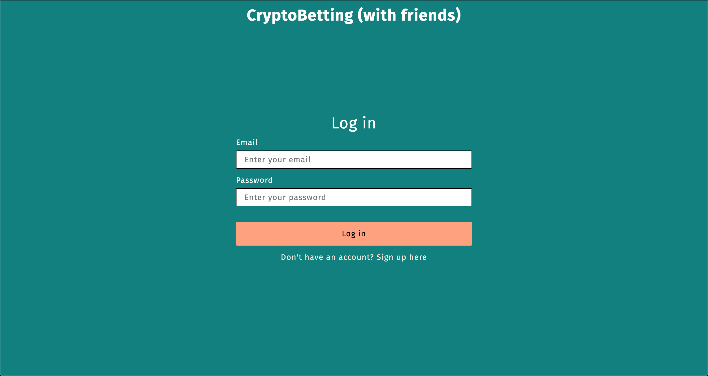

    2. The user creates a new account with their email, name and password.

    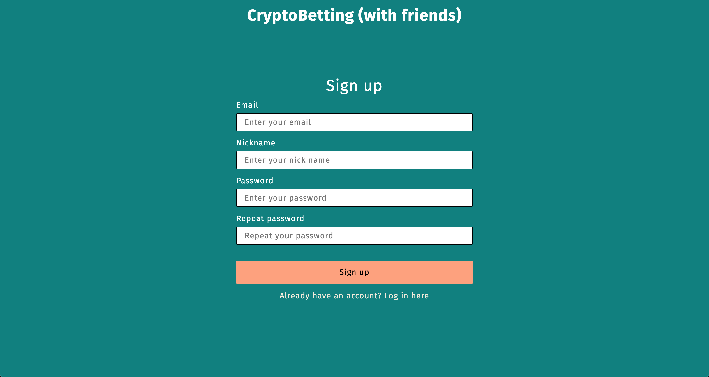

2. **Dashboard**

    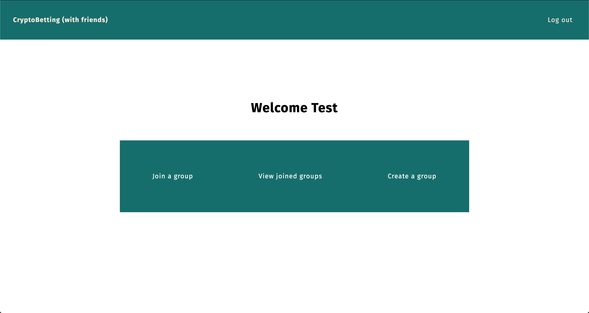

    1. A link to the page where a user can join an existing group from the platform.
    2. A link to the page where a user can view their joined groups. (Only active if they have any active and joined groups).
    3. A link to the page where a user can create a new group.

3. **Join / view joined / create groups**
    1. On the join page users are asked to select a group from the dropdown. Here they see a real-time list of other users that are in that group below, along with the currency that is being bet on. The user should press the join button once chosen a group that they would like to join. When a user joined a group, they are taken to the page that that group can be found on, where the user can place a bet.

    

    2. On the joined groups page, the user is greeted with a list of groups belonging to that user. When the user clicks on the name of a group, the user is taken to that groups detail page.

    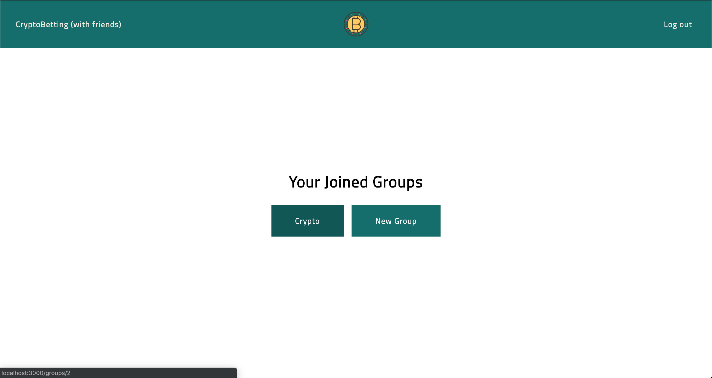

    3. When the user choose to create a new group, they are prompted with a window that contains a form. In this form, the group name, group currency and (if I have time, see [future enhancements](#future-enhancements) below) the group privacy level. When submitted, they are taken to the detail page of that group.

    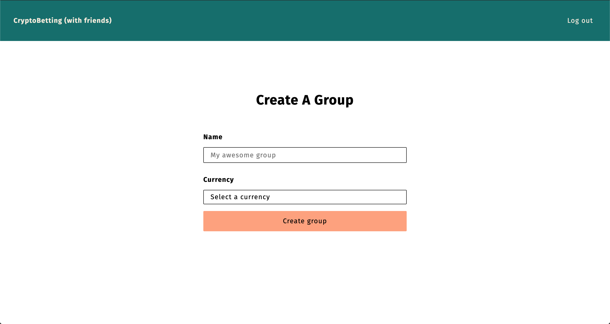

4. **Group detail page**
    On this page the user sees the currency, the group name and the participants. The participants are shown in a table form, where their name, their current bet and their amount of points is visible.
    On the row with your own name, which is highlighted, your betting field will be an input field with your current bet as default. You can change your bet by simply changing this dropdown.

    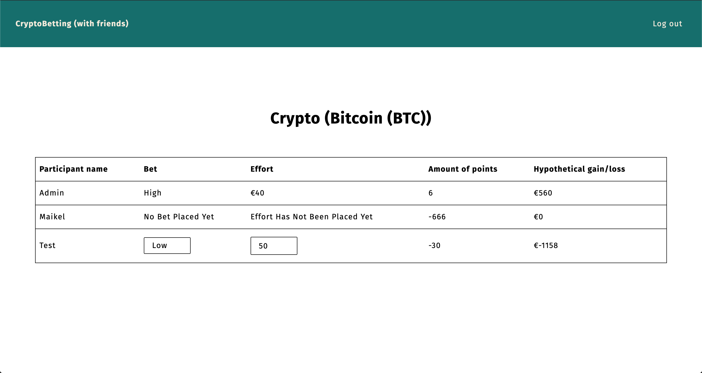

### Interaction flow

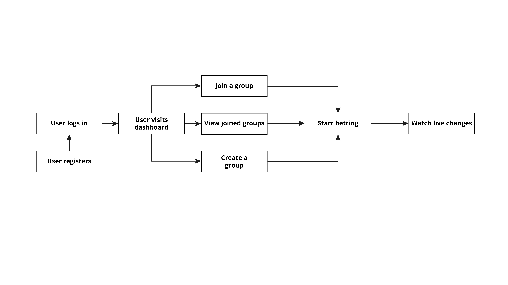

## API

The API that I am going to use for this project is [CryptoCompare](https://www.cryptocompare.com/). This is due to their seamingly easy API and pretty good limits.

### Limits

* The API only allows calls to the CryptoCompare server with a maximum of 300 crypto currencies to watch.
* Calls / month: 150,000
* Calls / day: 50,000
* Calls / hour: 25,000
* Calls / minute: 2,500
* Calls / second: 50

This API does not contain a websocket connection, unfortunately, but I found the APIs that do exist with a socket connection, to be very boring. The ones that I have found pretty much only include the large social platforms, like Facebook and Twitter. I do not like to use social media, which also made me hesitant to use these APIs. Then when I wanted to try to use the real-time Instagram API, it appeared to be offlined by Facebook in 2018.

I think that I can make something work with this API by polling a few times a second to simulate fully real-time data.

### Authorization

The API uses a single private key to enforce the limits that are explained above.
In the [dotenv](./env.example) file the key is used as follows: `CRYPTO_COMPARE_KEY='YOUR_KEY'`.

### Endpoints

* [Get all crypto currencies](https://min-api.cryptocompare.com/data/all/coinlist). This endpoint gives back an object of data with the crypto currency as a key, with the data it contains in an object in that key.

    From this endpoint I only use the `FullName`, `Symbol` and `SortOrder`. I store these (transformed) in the PostgreSQL database. This connection only happens when the `process.env.RUN_SEEDERS` is set to `'true'`.

    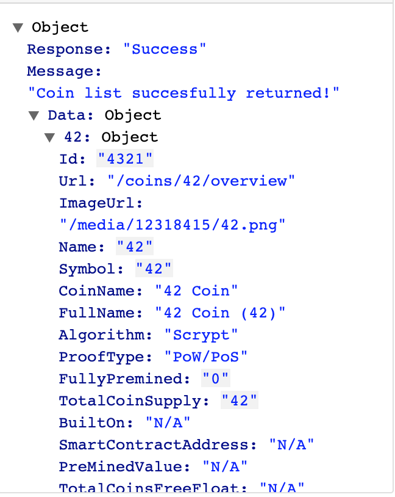
* [Get live updates for all crypto currencies](https://min-api.cryptocompare.com/data/pricemulti?fsyms=BTC,ETH&tsyms=EUR). This endpoint gives back an object with crypto currencies as keys, with an object containing the valuta of choice (this application will only use euro, because I am from Europe).

    This connection is being polled every second (more or less) and then stored in the `crypto_currencies` table in the database. The current value is being added to the `current_value` column.

    There is a maximum amount of ±50 currencies that you can request in one request.

    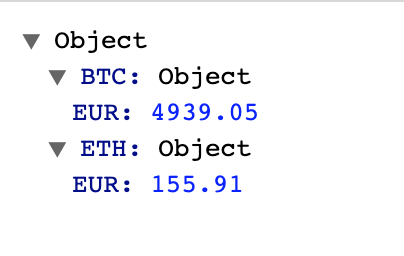

## Data life cycle

### Step by step

Due to the complexity of this applications server, I had issues getting across the message with images (I have made them though, as you can see [here](#version-2)), so I decided to also explain everything in text.

#### Setup

* All the [database tables](#Database-exploded-view) are being created.
* All the `_id` and `created_at` fields in the tables are created by PostgreSQL itself.
* The `session` table, and interaction with it, is being handled by `express-session`.

#### Seeding

Connection to the CryptoCompare API to seed the `crypto_currencies` table in the database.
From all this data (which can be seen [here](#Endpoints)) I only use `FullName`, `Symbol` and `SortOrder`.

#### Continuous

When the server is started up, there is a [polling](./server/src/www/poll.ts) connection setup to another CryptoCompare endpoint (also visible [here](#Endpoints)).

This poll is executed each ±1 second. Since there is a lot happening (database updates and real-time publishments) it might be not strictly each second.

This endpoint gives back for _each_ crypto currency requested an `object` with the key `EUR` and it's value the value of that crypto currency in euros.

This data is pretty much stored in a raw format in the `crypto_currencies` table under the column `current_value`. The `current_value` of that cryptocurrency at that moment is being set as the `value_history` of that currency. These two values is what makes the detail view of a group work.
They are used to compare wether or not a value has gone up in price or not.

This then looks for all the groups in which the crypto currency is used, and updates all the `group_participants` `hypothetical_gain` and `score` in that group according to their `bet` and `effort`.

This sounds complex, which it is, so here is an example: if a user has set their `bet` to `HIGH`, and the value of the crypto currency in that group goes up, they are rewarded a point added to their `score`, as well as that their `effort` (a value between 1 and 50 in euros) is being added to their `hypthetical_gain`.

If they are wrong, instead of adding a `score` and `effort`, they are subtracted.

#### Signup

1. User submitted data is validated on both the client and server.
2. The `email` and `username` data fields are placed in the `users` table as is, if there are no conflicts (for example duplicates).
3. The `password` is being hashed and then stored in the `users` table.

#### Login

1. User submitted data is validated on both the client and server.
2. `bcrypt` tries to find a match between the send data and the `users` table.

### Version 1

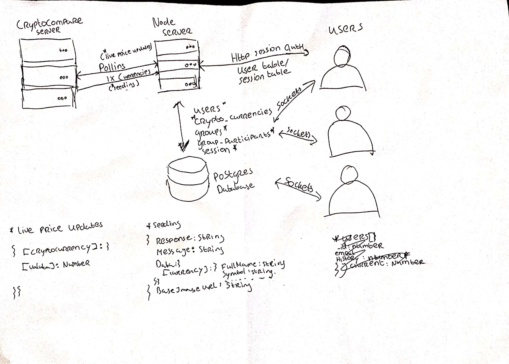

### Version 2

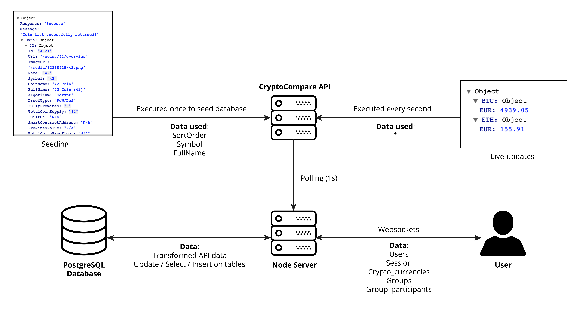

### Database exploded view

* **session** (created by express-session)
    * sid: `string`
    * sess: `json`
    * expire: `Date`
* **users**
    * _id: `number`
    * email: `string`
    * username: `string`
    * password: `string` (Hashed)
    * created_at: `Date`
* **crypto_currencies**
    * _id: `number`
    * name: `string`
    * value_history: `number` - Used to store the previous value of a specific currency in euros to compare with the current_value.
    * current_value: `number` - Used to store the current live value of a specific currency in euros.
    * sort_order: `number` - Used to determine if the crypto currency is in the top 50 most popular.
    * symbol: `string`
    * created_at: `Date`
* **group_participants**
    * _id: `number`
    * user_id: `number`
    * group_id: `number`
    * bet: `string` - The current predicted value by a user (HIGH/LOW).
    * effort: `number` - The amount a user has betted in euros.
    * hypothetical_gain: `number` - The amount of money the user would have earned or lost, if they were to use euros to bet.
    * score: `number` - Current amount of times the user has betted right on the course of the currency.
    * created_at: `Date`
* **groups**
    * _id: `number`
    * name: `string`
    * crypto_currency: `number`
    * created_at: `date`

## Features

* [X] Client-side error feedback.
* [X] Client-side rendering of the join groups page (_/groups/join_).
* [X] Data life cycle.
* [X] Feedback for real-time updates.
* [X] Get all the available cryptocurrencies from the API to list on the create a group page (_/groups/create_).
* [X] Group creation (_/groups/create_).
* [X] Interaction-flow.
* [X] Joining groups (_/groups/join_).
* [X] Login and signup (_/login_ & _/signup_).
* [X] Real-time bet and effort changes on _/groups/detail_.
* [X] Real-time updates for pretty much everything in the table on _/groups/detail_.
* [X] Real-time users being added to the list of users in a group on _/groups/join_.
* [X] Render all groups server-side in which the current user is present (_/groups/list_).
* [X] Server-side error feedback.

## Future enhancements

* [ ] Add ability to sort columns in the group detail table (**MEDIUM**).
* [ ] Add ability to view the current user and edit this user (**MAJOR**).
* [ ] Add server-side input validation (**MINOR**).
* [ ] Improve server security (**MEDIUM**).
* [ ] Make it possible for users to click through to a page where they can follow the currency in a graph in real-time (**MAJOR**).
* [ ] Make it possible for users to select a party privacy of _closed_, so that users can invite other people to their group (**MAJOR**).
* [ ] Make it possible to use all the crypto currencies that exist (over 4000) (**MAJOR**).
* [ ] Refactor database queries to be more concise (use nested joins) (**REFACTOR**).
* [ ] Render client-side data without innerHTML (**REFACTOR**).
* [ ] When a user signs up to the platform, they are not automatically logged in (**MINOR**).

## Sources

* CryptoBettings authentication model is heavily inspired by [this](https://github.com/timtamimi/node.js-passport.js-template) example.
* [Crypto icon](https://www.flaticon.com/free-icon/bitcoin_749701).

## License

This repository is licensed as [MIT](LICENSE) by [Maikel van Veen](https://github.com/maikxx).